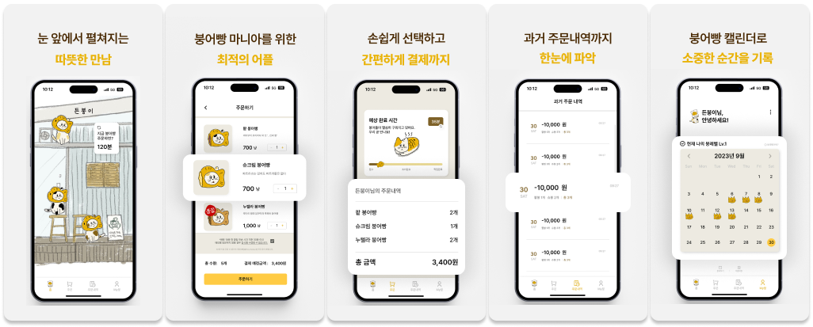
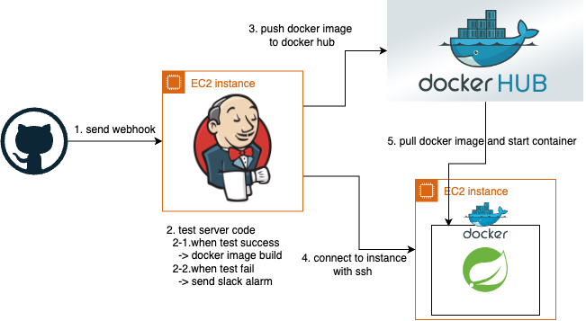

# 든붕이 붕어빵 미리 주문 서비스



---

## 소개

작년, 학교앞 카페에서 붕어빵을 먹으려면 밖에서 한시간 반 넘게 대기 해야 했어요.

어떻게 하면 편하고, 학우들이 붕어빵을 어떻게 더 편하게 먹을 수 있을까? 하는 고민을 했어요.

이 문제점을 해결하기 위해 붕어빵을 미리 주문하고, 결제할 수 있는 서비스인 "든붕이"(카페:든든 하쿠 + 붕어빵)가 탄생했어요!

든붕이는 붕어빵을 미리 주문/결제하여 긴 대기 시간을 절약할 수 있었습니다! :)

---

## 만든 사람들

|  |  |  |  |
|:----------------------------------------------------------------------------:|:----------------------------------------------------------------------------:|:----------------------------------------------------------------------------:|:----------------------------------------------------------------------------:|
|                      [박재완](https://github.com/wan2daaa)                      |                    [정경주](https://github.com/gyeongju1230)                    |                       [김민진](https://github.com/MeanJK)                       |                    [김선규](https://github.com/seongyu-Kim)                     |
|                                     백엔드                                      |                                 프론트엔드(사용자 앱)                                 |                                     백엔드                                      |                                 프론트엔드(관리자 앱)                                 |

---

## 기능

1. **예상 주문 시간**
    - 붕어빵 주문시 얼마나 소요될 지 예상 시간을 확인할 수 있어요!
2. **붕어빵 주문**
    - 붕어빵 종류, 수량을 선택하여 주문할 수 있어요!
3. **결제**
    - 카드나 토스 페이로 간편하게 결제할 수 있어요!
4. **주문 상태 확인**
    - 주문이 어떻게 진행되는지 확인할 수 있어요! (주문 접수, 조리중, 픽업 요청)
5. **주문 내역 확인**
    - 주문 내역을 확인할 수 있어요!
6. **붕어빵 캘린더**
    - 주문한 붕어빵을 캘린더에서 확인할 수 있어요!


---

## Skills

#### Language


#### Dependency


#### Database


#### Infra


#### Monitoring


## 프로젝트 구조

- 프로젝트는 **Spring Boot** 기반으로 구성되어 있어요.
- 최상단 패키지는 도메인별로 패키지를 구분하였고, 각 도메인 패키지는 레이어드 아키텍처로 구성되어있어요.

```text
.
├── prometheus
│   └── mysql
└── src
    ├── docs
    │   └── asciidoc
    ├── main
    │   ├── java
    │   │   └── com
    │   │       └── deundeunhaku
    │   │           └── reliablekkuserver
    │   │               ├── common
    │   │               │   ├── config
    │   │               │   ├── converter
    │   │               │   ├── domain
    │   │               │   ├── dto
    │   │               │   ├── exception
    │   │               │   ├── security
    │   │               │   │   └── filter
    │   │               │   └── service
    │   │               ├── excel
    │   │               │   └── controller
    │   │               ├── fcm
    │   │               │   ├── controller
    │   │               │   ├── dto
    │   │               │   └── service
    │   │               ├── jwt
    │   │               │   ├── constants
    │   │               │   ├── domain
    │   │               │   ├── repository
    │   │               │   ├── service
    │   │               │   └── util
    │   │               ├── member
    │   │               │   ├── constant
    │   │               │   ├── controller
    │   │               │   ├── domain
    │   │               │   ├── dto
    │   │               │   ├── repository
    │   │               │   └── service
    │   │               ├── menu
    │   │               │   ├── controller
    │   │               │   ├── domain
    │   │               │   ├── dto
    │   │               │   ├── repository
    │   │               │   └── service
    │   │               ├── order
    │   │               │   ├── constant
    │   │               │   ├── controller
    │   │               │   ├── domain
    │   │               │   ├── dto
    │   │               │   ├── repository
    │   │               │   └── service
    │   │               ├── payment
    │   │               │   ├── constants
    │   │               │   ├── controller
    │   │               │   ├── domain
    │   │               │   ├── dto
    │   │               │   ├── repository
    │   │               │   └── service
    │   │               ├── s3
    │   │               │   ├── dto
    │   │               │   └── service
    │   │               ├── scheduler
    │   │               ├── sms
    │   │               │   ├── constant
    │   │               │   ├── dto
    │   │               │   └── service
    │   │               ├── sse
    │   │               │   ├── dto
    │   │               │   ├── repository
    │   │               │   └── service
    │   │               ├── store
    │   │               │   ├── constant
    │   │               │   ├── controller
    │   │               │   ├── domain
    │   │               │   ├── repository
    │   │               │   └── service
    │   │               └── toss
    │   │                   └── constant
    │   └── resources
    │       └── submodule
    │           └── reliable-kku-server-submodule
    └── 
```

## 테스트, 배포 자동화 프로세스



1. webhook을 통해 Jenkins가 설치된 EC2 인스턴스에 push 이벤트를 전송해요
2. Jenkins는 전달받은 이벤트를 감지하고, 빌드 및 테스트를 진행해요
    1. 테스트가 성공하면, Docker 이미지를 빌드하고, docker hub에 push해요
    2. 테스트가 실패하면, slack으로 알림을 보내요
5. Jenkins에서 ssh를 통해 EC2 인스턴스에 접속한 후, docker 컨테이너를 실행해요

